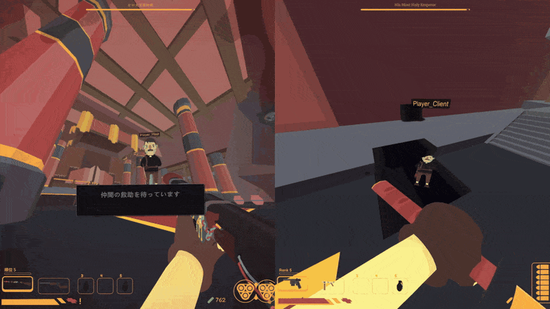
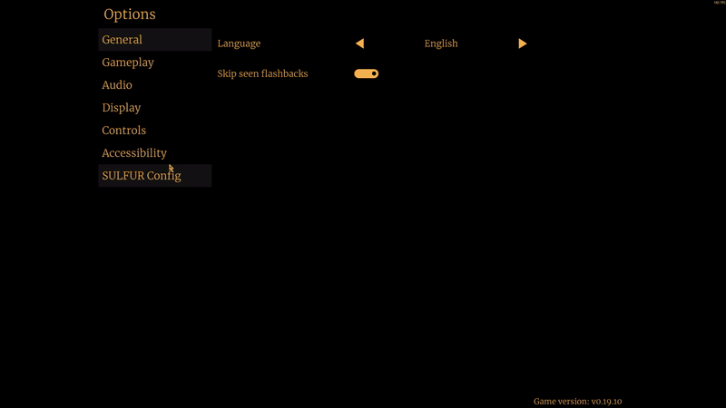
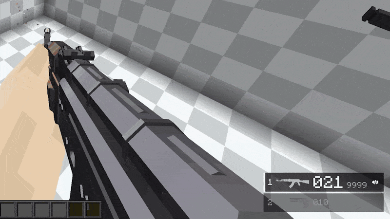
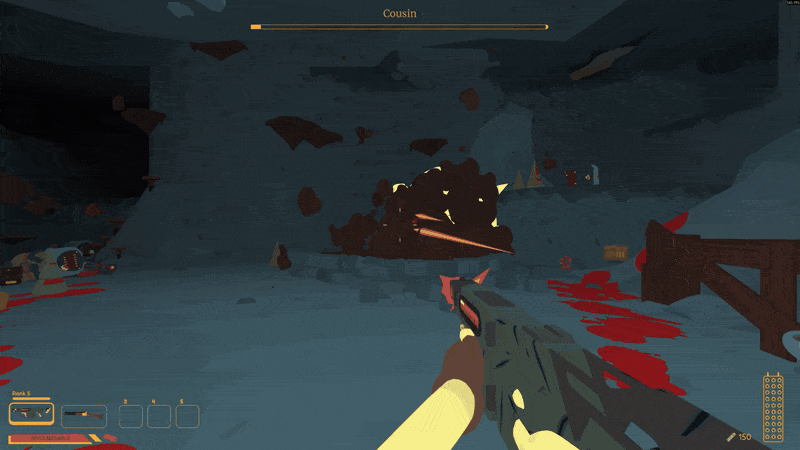

# Ryuka

I build mods and server-side systems for games: Minecraft (Forge 1.20.1, Java) and Unity games (BepInEx, C#).

**Open for commissions.** Minecraft mods, patches to mods you already run, server-side logic. Discord: `kumo67`

---

## Selected work

### SULFUR Together: co-op for a single-player game

SULFUR is single-player only. This mod adds host-authoritative co-op on top of it: shared level seeds, scene transitions, enemies and bosses run by the host, a downed-and-revive flow. Players connect through Steam invites or direct IP from an in-game menu. All of the hooks into the game came from reading its decompiled code.

281 C# files · 14 languages · 4,490 downloads · [source](https://github.com/ryuka-dev/SULFUR-Together)

### SULFUR Native UI Lib: settings pages inside the game's own menu

A library that lets other mods add their own pages to the game's Options screen, using the game's own row styles. Rows update in place, so the page doesn't rebuild when a value changes. If the game font is missing CJK or symbol glyphs, it falls back to another font. SULFUR Together, SULFUR Config and another author's chat mod all depend on it.

4,437 downloads · [source](https://github.com/ryuka-dev/SULFUR-Native-UI-Lib)

### Minecraft: patched forks for a modded Forge 1.20.1 server

I maintain forks of TaCZ, AutoModpack and LesRaisins Tactical for a modded server. Some of the changes:

- **AutoModpack**: upstream installs whatever jars the server lists. Now each update has to match an offline-signed manifest, and a mismatch rejects the whole update, so a compromised server can't push arbitrary jars to players.
- **TaCZ**: the client now knows the server's gun rules (wrong hotbar slot, player downed), so it no longer plays a reload the server is about to reject. The 51 MB default gun pack moved out of the jar (57 MB → 5.7 MB), so a code update no longer means a big download for every player.
- **TaCZ**: a server event with each bullet's real path every tick. You can't detect near misses by sampling bullet positions from outside, because the last segment, where near misses happen, gets lost.

Every jar sent to players has a tag with its full source. [Decade-Open](https://github.com/ryuka-dev/Decade-Open)

### False Gods: a custom boss that also works in multiplayer

An original boss in its own arena. It's reached through the game's own level generation, so navigation, spawning and fog work natively. It runs in single-player, or host-authoritative on top of SULFUR Together. I built the arena in Blender and Unity and ship it as an AssetBundle. Vanilla materials are loaded from the player's own install at runtime and never redistributed.

601 downloads · [source](https://github.com/ryuka-dev/False_Gods)

---

## Numbers

As of 2026-10-09:

- 27 SULFUR mods on [Thunderstore](https://thunderstore.io/c/sulfur/p/ryuka_labs/), 31,461 downloads
- 25 of the 32 non-deprecated mods in SULFUR's Thunderstore community are mine
- Mods localized into 14 languages

## What I take on

- Forge / NeoForge mods, server-side or client-side
- Changing how third-party mods behave: config, events or Mixin first, and a maintained fork when nothing lighter works
- Bugs and crashes in mods you already run
- Unity game mods (BepInEx, Harmony)

## How I work

- Before quoting, I'll ask about your Minecraft version, loader and the mods you run. That's what sets the size of the job.
- You get a price once the scope is clear, and it doesn't change unless the scope does.
- You get the source.

## Contact

- Discord: `kumo67` (fastest)
- Email: lingyun6677@gmail.com
- BuiltByBit: [ryuka](https://builtbybit.com/members/ryuka.941993/)

Based in Japan (UTC+9). English, Chinese, Japanese.

---

Also: [Mod Insight](https://github.com/ryuka-dev/Mod-Insight) collects daily stats for my mods from Thunderstore and Nexus Mods into Azure SQL, with a REST API and dashboard. [KyoumoMushoku](https://github.com/ryuka-dev/KyoumoMushoku) is a small 2D survival game in Unity (README in Japanese).
